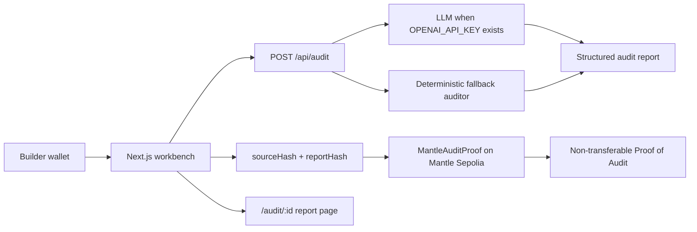

# Architecture

## Components

- Next.js workbench: contract input, report display, proof minting, local report pages.
- Audit API: calls an LLM when `OPENAI_API_KEY` is configured and falls back to a deterministic local analyzer.
- Hashing layer: creates stable keccak256 hashes for source text and normalized report JSON.
- Mantle contract: stores source hash, report hash, metadata URI, submitter, timestamp, and token ID.

## Diagram

## Data Flow

1. User enters Solidity code.
2. `POST /api/audit` generates an `AuditReport`.
3. Browser creates `sourceHash` and `reportHash`.
4. Browser saves the report in local storage for MVP demo use.
5. User calls `submitAudit` on Mantle Sepolia.
6. Contract emits `AuditSubmitted` and mints a non-transferable Proof of Audit.

## On-chain Storage

Only these fields are stored on-chain:

- submitter address
- source hash
- report hash
- metadata URI
- timestamp
- token ID

Full source code and full report content are not written to the chain.
